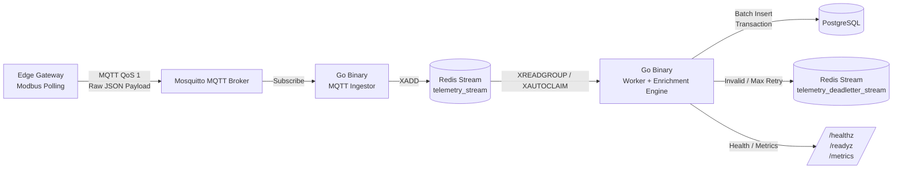

# Telemetry Ingestion Pipeline

Single Go binary for MQTT-ingested Modbus telemetry, Redis Streams buffering, and PostgreSQL persistence.

## Flow



## Features

- MQTT ingest with Redis Streams buffering
- Static `profiles.yaml` device registry
- Idempotent PostgreSQL writes with dedupe table
- Pending recovery via `XAUTOCLAIM`
- Deadletter stream for permanent failures
- `/healthz`, `/readyz`, `/metrics`
- Env-only runtime config
- **Selectable ingest mode**: normal (immediate) or coalesce (latest-wins)

## Ingest Modes

The service supports two modes, selected via `INGEST_MODE`:

### Normal Mode (default)

Every MQTT message is immediately buffered to Redis Stream and processed by the worker in batches.

- Full durability via Redis Stream
- Good for high-throughput scenarios with batch processing
- Worker runs `ProcessBatch` every `POSTGRES_BATCH_TIMEOUT`
- Each message yields its own DB row (one-to-one)

### Coalesce Mode

All MQTT messages go to Redis Stream (durable), but the worker reads them in batches and keeps only the **latest** telemetry value per `device_id|profile_id` in memory during each `INGEST_FLUSH_INTERVAL` window.

- **Latest-wins**: If multiple messages arrive for the same device, only the newest (by payload timestamp) is kept
- Deduplication happens **in the worker** before DB insert — reduces write volume
- All original Redis stream message IDs are tracked; after a successful DB insert, **all IDs are acked**
- Crash-safe: if the process crashes before flush, unacked messages stay in Redis Stream and are reclaimed via `XAUTOCLAIM`
- Flush interval: default 30s (configurable)

```bash
# Normal mode (default)
INGEST_MODE=normal go run ./cmd/telemetryd

# Coalesce mode with 30s flush interval
INGEST_MODE=coalesce INGEST_FLUSH_INTERVAL=30s go run ./cmd/telemetryd
```

**Why this works:** Redis Stream remains the source of truth in both modes. Coalesce mode changes only the consumer-side aggregation strategy, not the ingest pipeline. This means you get both deduplication and crash recovery.

---

## Runtime Configuration

Runtime settings come from environment variables only.

Required basics:
- `POSTGRES_DSN`
- `REDIS_URL`
- `MQTT_URL`

Other common variables:
- `SERVICE_NAME`
- `INSTANCE_ID`
- `LOG_LEVEL`
- `HTTP_LISTEN_ADDR`
- `MQTT_CLIENT_ID`
- `MQTT_TOPIC`
- `MQTT_USERNAME`
- `MQTT_PASSWORD`
- `REDIS_DB`
- `REDIS_STREAM`
- `REDIS_DEADLETTER_STREAM`
- `REDIS_GROUP`
- `REDIS_CONSUMER`
- `REDIS_READ_COUNT`
- `REDIS_BLOCK_TIME`
- `REDIS_MIN_IDLE_TIME`
- `POSTGRES_MAX_WRITE_CONNS`
- `POSTGRES_MAX_READ_CONNS`
- `POSTGRES_BATCH_SIZE`
- `POSTGRES_BATCH_TIMEOUT`
- `WORKER_MAX_RETRIES`
- `WORKER_RETRY_BACKOFF_INITIAL`
- `WORKER_RETRY_BACKOFF_MAX`
- `PROFILES_PATH`
- `INGEST_MODE`
- `INGEST_FLUSH_INTERVAL`

See `.env.example` for a full example.

## Device Profiles

`profiles.yaml` contains the static profile registry used by the worker to map raw register values into semantic metrics.

## Database Migrations

Use plain PostgreSQL SQL files under `migrations/`:

- `001_create_telemetry_enriched.sql`
- `002_create_telemetry_ingest_dedupe.sql`
- `003_create_indexes.sql`

Run migrations before starting the service.

## Run

```bash
go run ./cmd/telemetryd
```

## Endpoints

- `GET /healthz`
- `GET /readyz`
- `GET /metrics`

## Project Structure

```text
cmd/telemetryd              # Entry point
internal/core               # Domain, ports, services
internal/adapters           # MQTT, Redis, PostgreSQL, HTTP, YAML profile loader
internal/platform           # config, logging, metrics, shutdown, runtime
migrations/                 # PostgreSQL SQL migrations
profiles.yaml               # Static device profile registry
```

## Notes

- No `config.yaml` runtime file is used.
- TimescaleDB is not required for v1; PostgreSQL is enough.
- The worker uses idempotent writes and retry-aware deadlettering.
