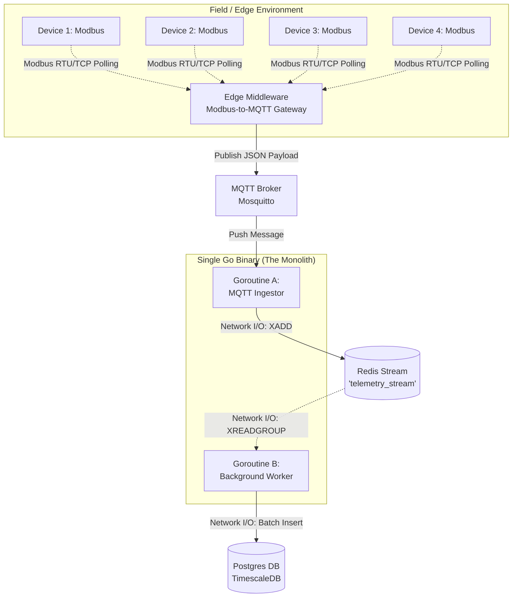

# MQTT Consumer with Redis Streams and PostgreSQL

```mermaid
graph TD
    %% Define External Entities
    subgraph "Field / Edge Environment"
        D1[Device 1: Modbus]
        D2[Device 2: Modbus]
        D3[Device 3: Modbus]
        D4[Device 4: Modbus]
        GW[Edge Middleware\nModbus-to-MQTT Gateway]
    end

    MQTT_B[MQTT Broker\nMosquitto]
    R_S[(Redis Stream\n'telemetry_stream')]
    P_DB[(Postgres DB\nTimescaleDB)]

    %% Define Deployment Boundary
    subgraph "Single Go Binary (The Monolith)"
        G_C[Goroutine A:\nMQTT Ingestor]
        G_W[Goroutine B:\nBackground Worker]
    end

    %% Define Connections
    D1 -.->|Modbus RTU/TCP Polling| GW
    D2 -.->|Modbus RTU/TCP Polling| GW
    D3 -.->|Modbus RTU/TCP Polling| GW
    D4 -.->|Modbus RTU/TCP Polling| GW

    GW -->|Publish JSON Payload| MQTT_B

    MQTT_B -->|Push Message| G_C

    %% The Critical Decoupling Phase
    G_C -->|Network I/O: XADD| R_S
    R_S -.->|Network I/O: XREADGROUP| G_W

    G_W -->|Network I/O: Batch Insert| P_DB

```
