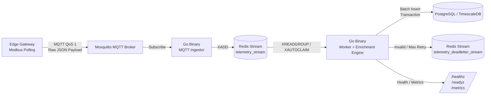
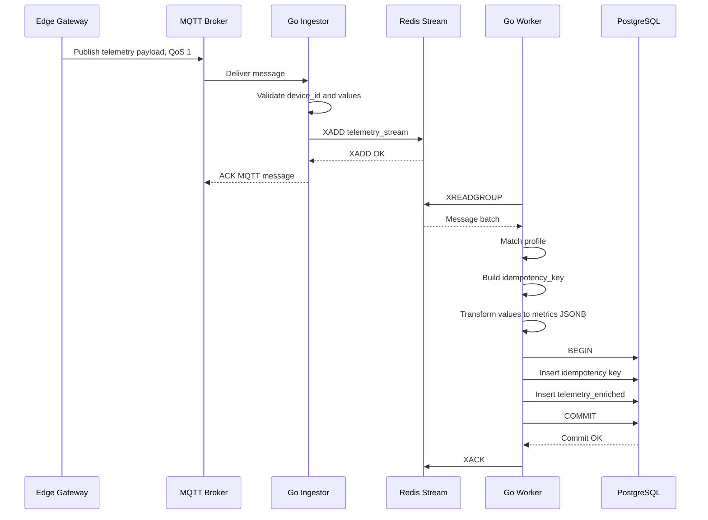
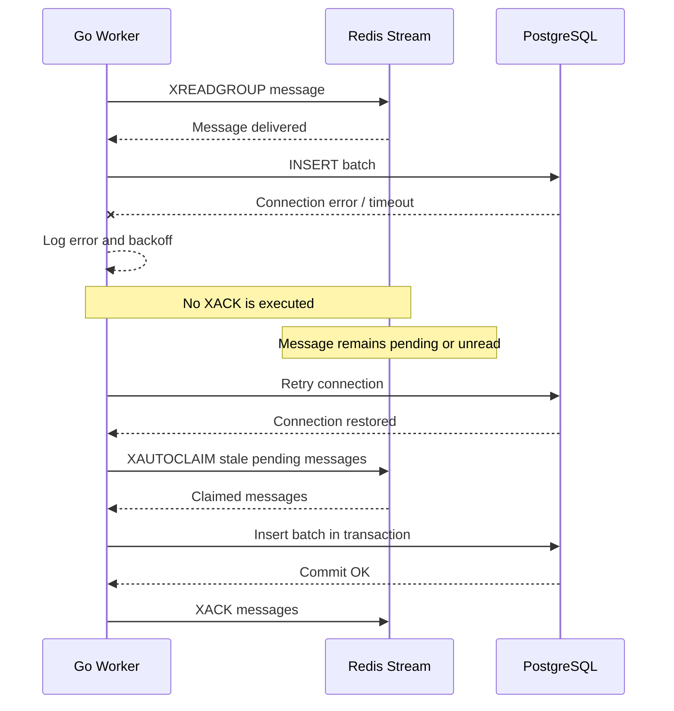
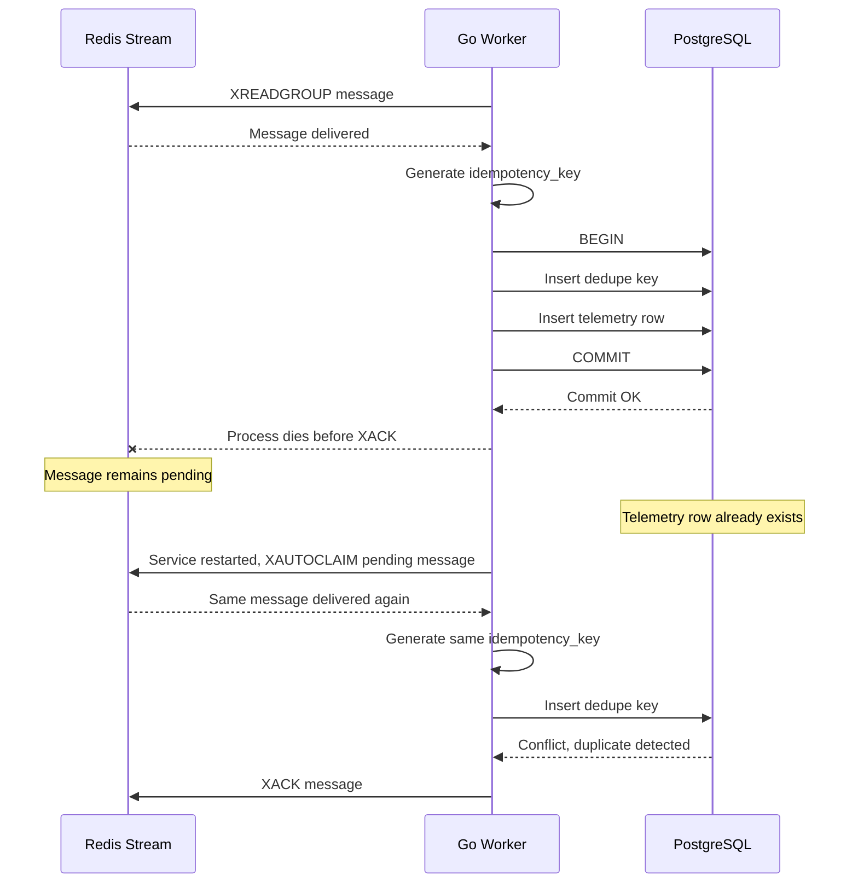
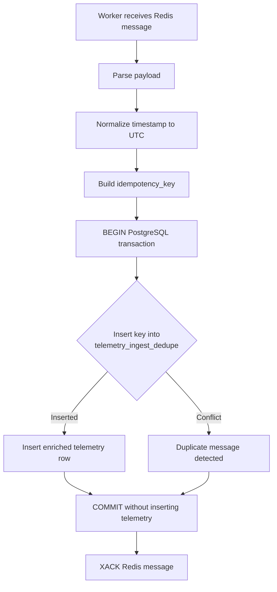
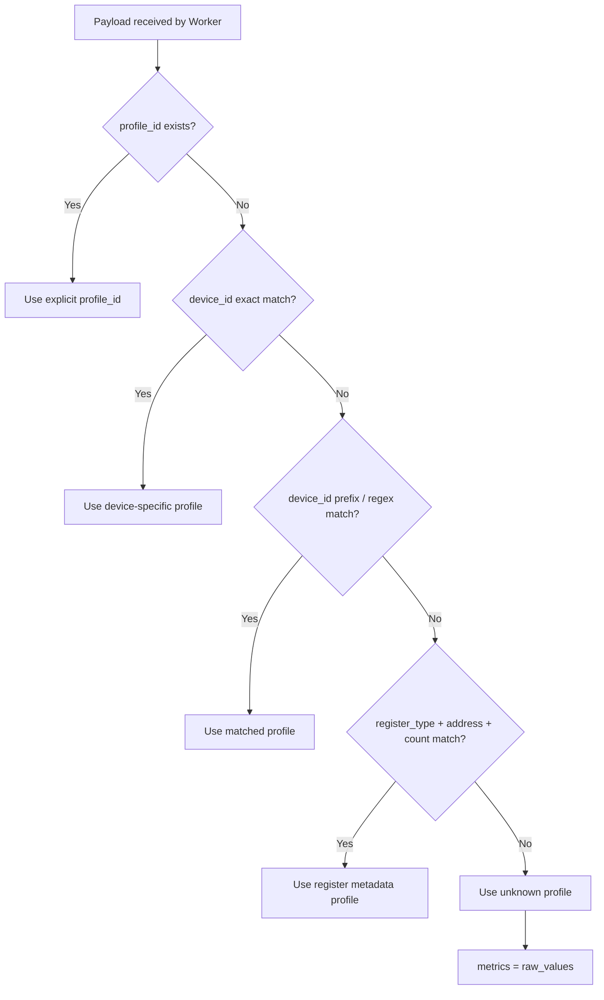
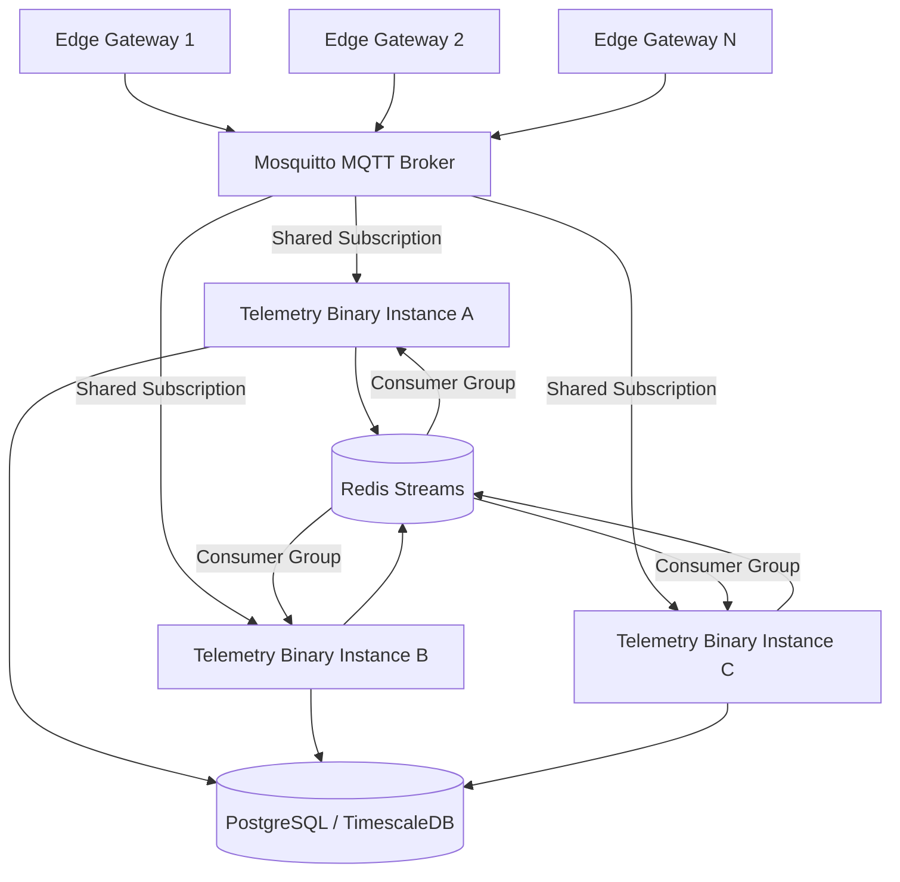
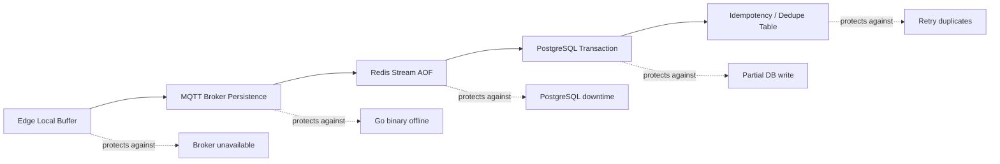
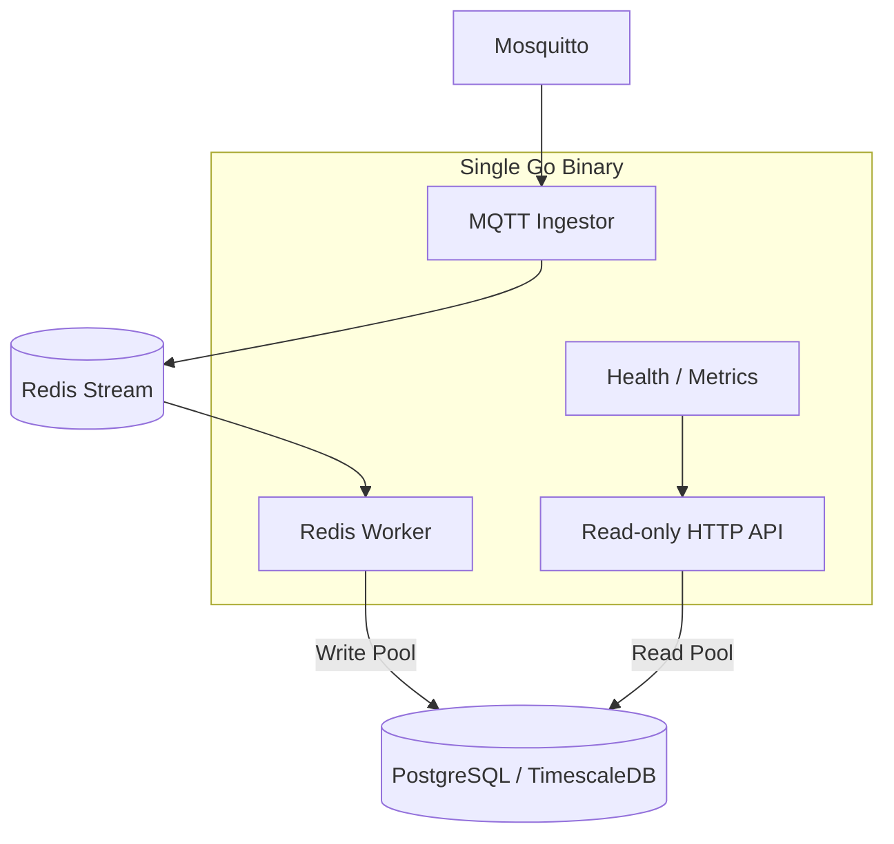

# Telemetry Ingestion Pipeline — Operations Appendix

**System:** Telemetry Ingestion Pipeline, Enriched JSONB
**Version:** v1.0 Draft
**Purpose:** Diagrams, deployment notes, configuration examples, metrics, and implementation phases.

---

## 1. Visual Design Diagrams

## 1.1 System Context Diagram



---

## 1.2 Normal Message Processing Sequence



---

## 1.3 PostgreSQL Downtime Recovery



---

## 1.4 Binary Crash After PostgreSQL Commit but Before Redis XACK



---

## 1.5 Idempotency Insert Flow



---

## 1.6 Profile Matching Flow



---

## 1.7 Single Binary, Multiple Instances Deployment



---

## 1.8 Reliability Boundary Diagram



---

## 1.9 API Topology Diagram



---

## 2. Configuration Example

```yaml
service:
  name: "telemetry-ingestion-service"
  instance_id: "host01"
  log_level: "info"

mqtt:
  broker: "tcp://localhost:1883"
  client_id: "telemetry-ingestion-service"
  topic: "telemetry/raw/#"
  qos: 1
  clean_session: false
  username: ""
  password_env: "MQTT_PASSWORD"

redis:
  addr: "localhost:6379"
  password_env: "REDIS_PASSWORD"
  db: 0
  stream: "telemetry_stream"
  deadletter_stream: "telemetry_deadletter_stream"
  group: "telemetry_workers"
  consumer: "host01-worker"
  read_count: 500
  block_time: "1s"
  min_idle_time: "60s"

postgres:
  dsn_env: "POSTGRES_DSN"
  max_write_conns: 10
  max_read_conns: 5
  batch_size: 500
  batch_timeout: "1s"

profiles:
  path: "./profiles.yaml"

worker:
  max_retries: 5
  retry_backoff_initial: "1s"
  retry_backoff_max: "60s"

http:
  listen_addr: ":8080"
```

---

## 3. Observability

## 3.1 HTTP Endpoints

```text
GET /healthz
GET /readyz
GET /metrics
```

## 3.2 Health Check

`/healthz` returns OK if the process is running.

It should not require PostgreSQL or Redis to be healthy.

## 3.3 Readiness Check

`/readyz` returns OK only if critical dependencies are reachable:

```text
Redis reachable
PostgreSQL reachable
MQTT connected or reconnecting within allowed state
profiles.yaml loaded successfully
```

## 3.4 Recommended Metrics

```text
mqtt_messages_received_total
mqtt_messages_rejected_total
mqtt_messages_acknowledged_total
redis_xadd_success_total
redis_xadd_error_total
redis_stream_backlog
redis_pending_count
worker_messages_read_total
worker_messages_processed_total
worker_messages_duplicate_total
worker_messages_failed_total
worker_messages_deadlettered_total
postgres_insert_success_total
postgres_insert_error_total
postgres_commit_duration_ms
worker_batch_size
worker_batch_insert_duration_ms
profile_unknown_total
profile_match_error_total
service_restarts_total
```

---

## 4. Deployment Notes

## 4.1 Single Binary, Single Instance

Minimum deployment:

```text
1 Go binary process
1 MQTT broker
1 Redis instance
1 PostgreSQL instance
```

This is simple but has downtime when the binary restarts. Data should still be retained by MQTT broker, Redis, and Edge buffers.

---

## 4.2 Single Binary, Multiple Instances

Recommended production deployment:

```text
Same binary, multiple running instances
```

MQTT shared subscription:

```text
$share/telemetry_ingestors/telemetry/raw/#
```

Redis consumer group:

```text
telemetry_workers
```

---

## 4.3 systemd Example

```ini
[Unit]
Description=Telemetry Ingestion Service
After=network-online.target redis.service postgresql.service mosquitto.service
Wants=network-online.target

[Service]
ExecStart=/opt/telemetry/telemetry-service --config /opt/telemetry/config.yaml
Restart=always
RestartSec=2
StartLimitIntervalSec=0
WorkingDirectory=/opt/telemetry
EnvironmentFile=/opt/telemetry/.env
LimitNOFILE=65535

[Install]
WantedBy=multi-user.target
```

---

## 5. Redis Configuration

Recommended Redis persistence:

```conf
appendonly yes
appendfsync everysec
```

For stricter durability but lower performance:

```conf
appendfsync always
```

Avoid using aggressive Redis Stream `MAXLEN` trimming for critical telemetry unless data loss is acceptable.

---

## 6. Mosquitto Configuration

Recommended persistence:

```conf
persistence true
persistence_location /var/lib/mosquitto/
autosave_interval 5
```

Recommended client behavior:

```text
QoS 1
Stable client_id
Persistent session
```

---

## 7. Database Maintenance

## 7.1 TimescaleDB

Useful features if available:

```text
hypertable
compression
retention policy
continuous aggregates
```

## 7.2 Plain PostgreSQL

If TimescaleDB is not available, use:

```text
native range partitioning by time
BRIN index on time
B-tree index on device_id, time DESC
GIN index on JSONB metrics
manual or automated partition retention
```

Example retention action:

```sql
DROP TABLE telemetry_enriched_2024_01;
```

Possible automation tools:

```text
pg_partman
pg_cron
external scheduler
application maintenance job
```

---

## 8. Security Notes

1. Do not log secrets.
2. Avoid logging full payloads at high volume unless debug mode is enabled.
3. Use TLS for MQTT/PostgreSQL/Redis where required.
4. Store passwords in environment variables or secret manager.
5. Validate payload size.
6. Set MQTT topic ACLs.
7. Use database user with minimum required privileges.

---

## 9. Implementation Phases

## Phase 1 — Core Pipeline

1. Load config.
2. Load profiles.yaml.
3. MQTT subscribe.
4. Validate minimal payload.
5. XADD to Redis.
6. Worker XREADGROUP.
7. Transform values to metrics.
8. Insert to PostgreSQL.
9. XACK after commit.

## Phase 2 — Reliability Hardening

1. Add idempotency key.
2. Add dedupe table.
3. Add XAUTOCLAIM pending recovery.
4. Add deadletter stream.
5. Add PostgreSQL retry/backoff.
6. Add graceful shutdown.

## Phase 3 — Observability and Operations

1. Add `/healthz`.
2. Add `/readyz`.
3. Add `/metrics`.
4. Add structured logging.
5. Add systemd/container deployment.
6. Add Redis and Postgres dashboard metrics.

## Phase 4 — Scaling

1. Support multiple binary instances.
2. Use MQTT shared subscriptions.
3. Tune batch size and timeout.
4. Add TimescaleDB compression/retention or PostgreSQL partition retention.
5. Add generated columns, summary tables, or materialized views for common analytics.

---

## 10. Open Questions

1. Will Edge Gateway always send `timestamp`?
2. Will Edge Gateway generate `message_id`, or should backend always generate it?
3. Which MQTT Go library will be used, and does it support manual ACK?
4. What is the expected telemetry rate per device and total devices?
5. What is the maximum expected PostgreSQL downtime to buffer in Redis?
6. What is the required retention period?
7. Should raw payload always be stored, or only for unknown/error cases?
8. Should profiles support multi-register decoding in v1?
9. Should unknown profiles be stored in main table or separate raw table?
10. Will deployment run one process only or multiple instances of the same binary?
